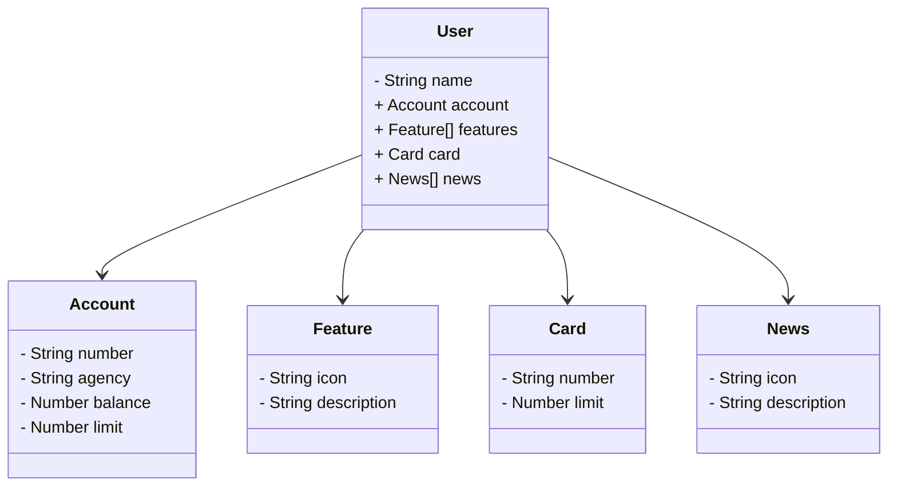

# Santander Dev Week 
O projeto é uma simulação de uma aplicação bancária com funcionalidades básicas. O objetivo é proporcionar uma experiência prática no desenvolvimento de uma aplicação completa utilizando Java e Spring Boot.

## Estrutura do Projeto
O projeto é composto por várias entidades que representam elementos comuns de um sistema bancário, como Usuário, Conta, Cartão e Notícias. A seguir está um diagrama de classes que ilustra a estrutura do projeto:

## Diagrama de Classes

## Tecnologias Utilizadas
- **Java:** Linguagem de programação principal do projeto.
- **Maven:** Ferramenta de automação de compilação e gerenciamento de dependências.
- **Spring Boot:** Framework utilizado para facilitar a criação e configuração da aplicação.

## Contribuições
Contribuições são bem-vindas! Sinta-se à vontade para abrir issues e enviar pull requests.

## Contato
Para mais informações, entre em contato com o desenvolvedor:

[Sandy Caires](https://github.com/cairessandy)
